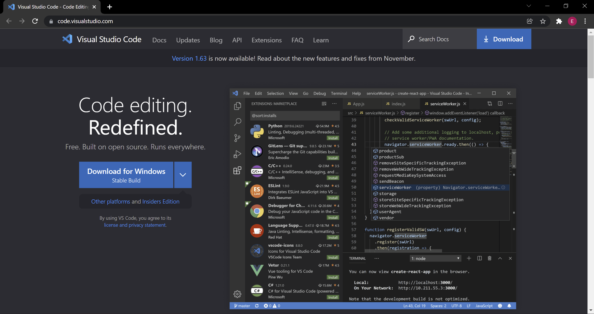
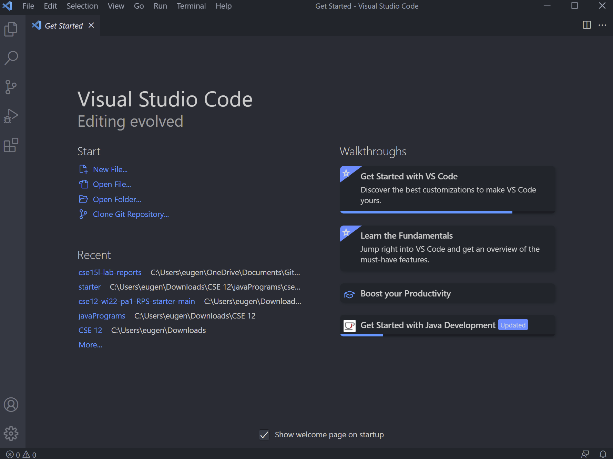
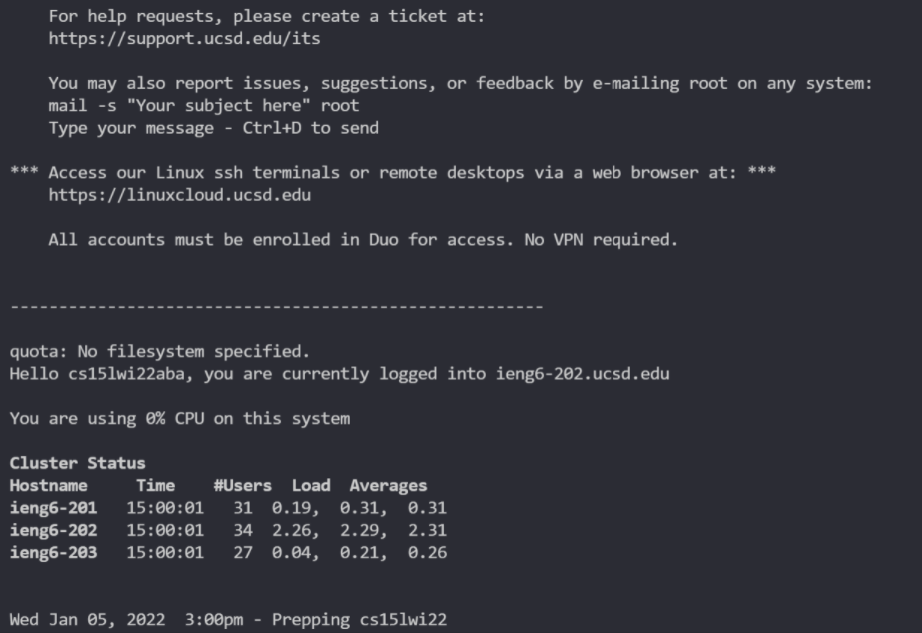
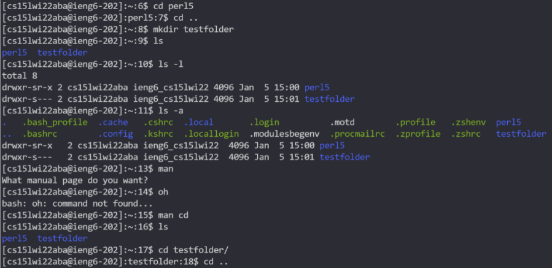
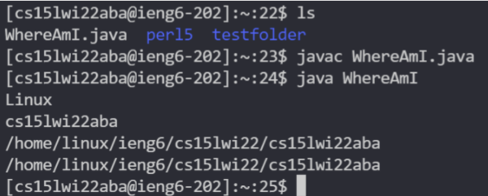
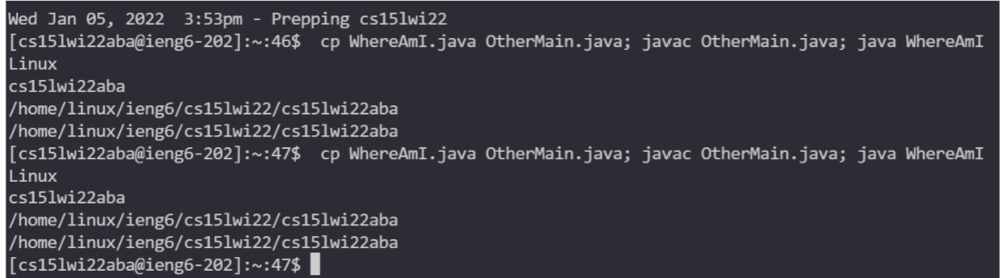

[Back](https://playereugene.github.io/cse15l-lab-reports/)
# Lab 1 Report
This page is for describing the steps for lab 1.\
How to log into a course-specific account on `ieng6`

## Step 1 - Installing VS Code
The first step is to install [Visual Studio Code](https://code.visualstudio.com/)

After you finish downloading the program, open it and the image below sould show up on your screen.


## Step 2 - Remotely Connecting
Now that you have VS code, you will try to connect to a remote server through VS code.\
First, install [OpenSSH](https://docs.microsoft.com/en-us/windows-server/administration/openssh/openssh_install_firstuse).\
After that, in order to connect to your `ieng6` account, you will have to find your unique account name from this [link](https://sdacs.ucsd.edu/~icc/index.php).\
Now that you have your account, open terminal on VS Code (you can do this by using the keyboard shortcut Ctrl+Shift+` or from the terminal tab). In your terminal, type the command below but with **your unique account name**
```
$ ssh cs15lwi22aba@ieng6.ucsd.edu
```
Say `yes` to the warning and then you should see something like the image below

If you see this screen, it means you are now logged into the UCSD server!

## Step 3 - Trying Some Commands
With the terminal connected, we can try some useful commands and see what they do. Try to run some basic commands such as `cd`, `ls`, `pwd`, `mkdir`, and `cp`
Some other useful commands to try are:
* `cd ~`
* `ls -lat`, `ls -a`, and `ls /home/linux/ieng6/cs15lwi22/cs15lwi22aba` where the directory is **someone elses**
* `cp /home/linux/ieng6/cs15lwi22/public/hello.txt ~/`
* `cat /home/linux/ieng6/cs15lwi22/public/hello.txt`\
Below are the outputs of some commands

If you want to exit the terminal, you can use Ctrl+D or type `exit`

## Step 4 - Moving Files with `scp`
A common need when using `ssh` to connect to a remote server is to copy files from and to the remote server. This can be achieved using the handy **`scp` command**.\
For example, let's first go back to the computer terminal using `exit` or *creating a new terminal*.\
Now, make a file, `WhereAmI.java`, and put the following program into it:
```
class WhereAmI {
  public static void main(String[] args) {
    System.out.println(System.getProperty("os.name"));
    System.out.println(System.getProperty("user.name"));
    System.out.println(System.getProperty("user.home"));
    System.out.println(System.getProperty("user.dir"));
  }
}
```
This small program lets you see where you are, *whether it is your computer or the UCSD server*\
Try running this program on your computer.\
Then in the terminal (still on your computer terminal, not UCSD's), run the code
```
scp WhereAmI.java cs15lwi22aba@ieng6.ucsd.edu:~/
```
with **your directory** instead.\
Enter your password if needed then try running the copied file in your UCSD terminal. Instead of your computer informtion, you should now see the *remote server's information* instead like below:


## Step 5 - Setting an SSH Key
To create an SSH Key in order to make logging onto your remote server easier, first go to **your computer's terminal**.\
When you are at your computer's terminal, run the command `ssh-keygen` and input where you want the key to be and a password if you would like. *You can also skip these by pressing enter for the defauly and no password*\
Now that you have your public and private key, get back onto the server terminal by using the command
```
$ ssh cs15lwi22aba@ieng6.ucsd.edu
```
with **your directory** and enter your password.\
on the UCSD terminal, run the command `mkdir .ssh` and logout.\
This created a .ssh directory on the remote server to which you will copy the ***public key*** to.\
In order to copy the ***public key*** from your computer to the server, run
```
$ scp C:\Users\eugen\.ssh\id_rsa.pub cs15lwi22aba@ieng6.ucsd.edu:~/.ssh/authorized_keys
```
but with **your directory** and the **server directory** respectively.\
Below is what should appear if you try to log in with this key:

Now that you have done this, you can use `ssh` and `scp` without a password on your computer!

## Step 6 - Optimizing Remote Running
Some tips on how to optimize running commands in terminal are to put commands at the end of an `ssh` command in quotes in order to run the command in the server you are connecting to.\
Another useful trick is to use semicolons to differentiate different lines of code in one line rather than running many commands. An example is shown below:


And that's it! You are ready to use VS code to connect to UCSD's remote server.