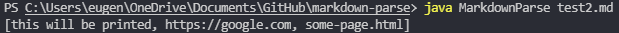
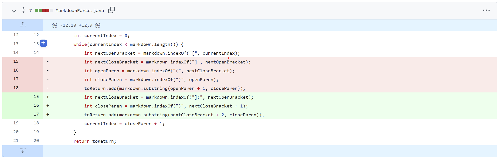
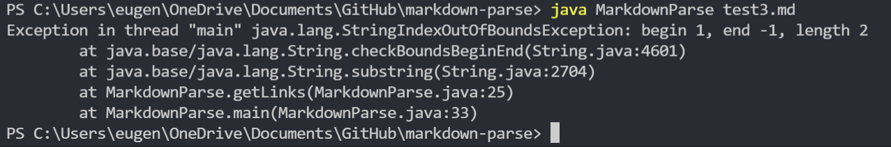
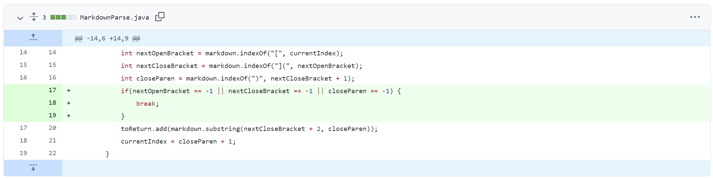
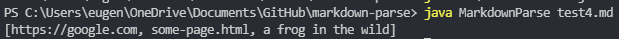
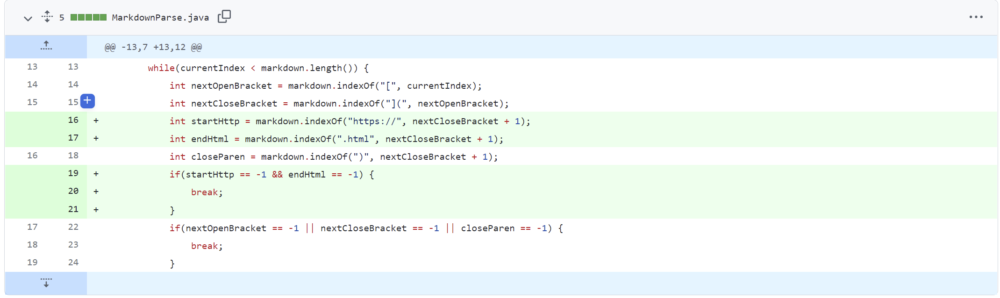

[Back](https://playereugene.github.io/cse15l-lab-reports/)
# Lab 2 Report
This page is for describing errors fixed in the original MarkdownParse.java file for lab 2.\
This lab will talk about three changes to the original code that fixed various errors.

## Pre-lab information
My fork with code and all the fixed errors are in my GitHub repository [here](https://github.com/PlayerEugene/markdown-parse)\
The original code created by Joe Politz is [here](https://github.com/ucsd-cse15l-w22/markdown-parse)

## Error 1 - Seperation between **close bracket** and **open parenthesis**
The first error my lab group decided to address was when there was a close bracket, then some type of text or filler, then an open parenthesis. This would mean that there is not a link in that spot, rather maybe something like an array followed by more detailed explanantion in the parentheses like such as:
```
[1, 2, 3, 4] this is an array (array of ints)
```
this code theoretically, for the original program should work but is not actually a link.\
This [test file](https://github.com/PlayerEugene/markdown-parse/blob/main/test2.md) is a *failure-inducing input*.\
The file above when run with the original program comes up with the following output array:
```
[this will be printed, https://google.com, some-page.html]
```
We see this in the terminal when we run \
Clearly from this output we can immedately see that `this will be printed` is not a link at all. However, without this test file, I would not have been able to find this error. The file let me find out that there was a case where the original program did not work and thus I could fix it.

In order to fix this program, I made the following changes to the original code:

So what this change effectively does it that it checks if the **close bracket** is next to the **open parenthesis**. This new program now excludes all cases where the text contains brackets then parentheses since those would not be considered links.

## Error 2 - Missing **brackets** or **parentheses**
The second error my lab group decided to address was when there were missing brackets and parentheses in the code. This could, in the *original code*, result an error and sometimes even an infinite loop. So something like the following
```
)[oops I misplaced my close bracket(https://something.com)
```
would result in an error since the close bracket is never found which returns -1 for `nextCloseBracket` and thus the subsequent code would not give the right `indexOf` values.\
This [test file](https://github.com/PlayerEugene/markdown-parse/blob/main/test3.md) is a *failure-inducing input*.\
The file above when run with the original program comes up with the following error:

So how do we fix this error? I made the following changes which fixed this error completely.

By adding this if statement, the program checks if any of the brackets or parentheses are not found and then breaks from the loop if they are not. This effectively skips the loop if there is an erraneous link which results in no error coming up.\
I only found this bug in the program because of the test file that I came up with and ran which gave me the error message (or the *symptom*). Through this catch I was able to add the code in order to solve this issue.

## Error 3 - Fake Links
The third error that was fixed was when there was a link but the link was not a link and something like a message. This would pass the program but end up not being a link; one example being the following:
```
[link name](this is not a link)
```
This code does not have a link but will still show up in the list of links.\
This [test file](https://github.com/PlayerEugene/markdown-parse/blob/main/test4.md) is a *failure-inducing input*.\
The file above when run with the original program comes up with the following output array:
```
[https://google.com, some-page.html, a frog in the wild]
```
We see this in the terminal when we run \
Immedately, we can see that `a frog in the wild` is not a link at all. However, without this test file, I would not have been able to find this error. The file let me find out that there was a case where the original program did not work and thus I could fix it by adding extra parameters.

In order to fix this program, I made the following changes to the original code:

With this addition to the code, the program now does not include links that are not *https://* or *.html*.