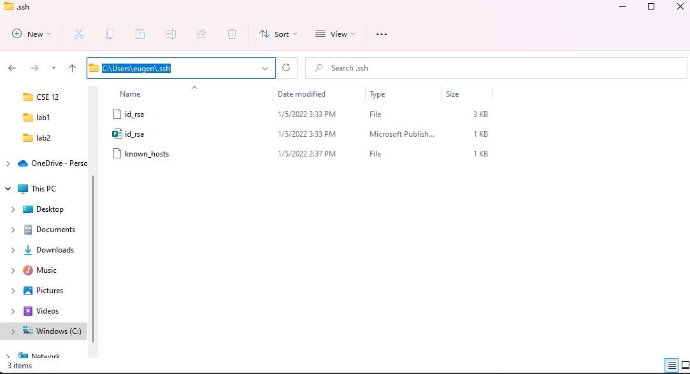
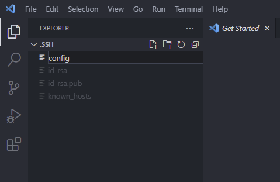
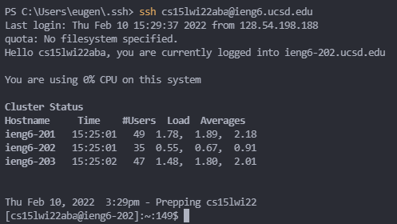
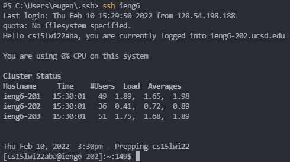
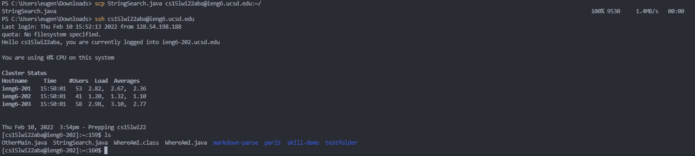
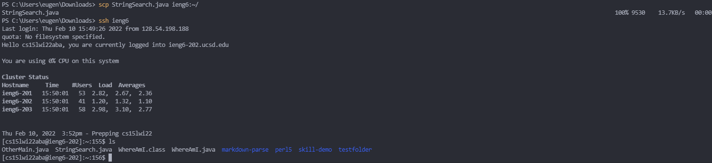

[Back](https://playereugene.github.io/cse15l-lab-reports/)
# Lab 3 Report
This page is for setting up ***Streamlining ssh Configuration*** and the steps to do it.

## Step 1 - Creating and Editing `.ssh/config`
The first step is to find the .ssh directory in your device. In order to do this I found it easy to go to your *File Explorer* and go to `Windows C:`.\
Then go to `Users` then click on your username. In my case it is a shortened version of my name, `eugen`.\
In this directory, you should see a `.ssh` folder near the top of the list.\
Below is a screenshot of my directory and the files in `.ssh`. 
Now that you are in the .ssh folder, copy the path and then open the folder in VScode. If you do not have a config file like me, you can just create one like I did in the image below. \
In this newly created file, add the following code to your file ***with your own username***
```
Host ieng6
    HostName ieng6.ucsd.edu
    User cs15lwi22aba
```

## Step 2 - Trying out the new SSH command
Now that everything in your config file is set up, it is time to test it.\
To try out your new, shortened command, compare using `ssh cs15lwi22aba@ieng6.ucsd.edu` with your username of course, and `ssh ieng61` or whatever you set your new shortcut name to. Below is the comparison:\
\
\
You can see that the bottom image using `ssh ieng6` is a lot easier than the top option using the acutal username.\
Now that you have this working, lets try using this with `scp`.\
Like before, we will use the same switch to run scp.\
For my case, I copied a file called `StringSearch.java` from my local desktop to the server.\
\
\
WIth this, we can now see that our `config` file is working correctly.