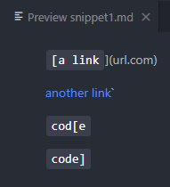

[Back](https://playereugene.github.io/cse15l-lab-reports/)
# Lab 4 Report
This page is for describing errors fixed in the original MarkdownParse.java file for lab 2.\
This lab will talk about three changes to the original code that fixed various errors.

## Pre-lab information
My GitHub repository [here](https://github.com/PlayerEugene/markdown-parse)\
The GitHub repository to the program I reviewed [here](https://github.com/ShashankVenkatramani/markdown-parse)

## Snippet 1
This is what snippet 1 should produce according to VS code's preview.
\
Based on this visual, we can assume that the output of MarkdownParse should be the last 3 attempted links since those are clickable while the first one simply outputs the code.\
So based on this, we can create a replica output of
```
[`google.com, google.com, ucsd.edu]
```
Now that I had an idea of what the output should be, I added the following test to check if the program would give me the same output in MarkdownParse.java for **both** my code and the code of the person I was reviewing.
\
When we run the tester with this method, we get 2 different errors using my program and the other program.\
My program gave an error like:
\
The other program gave an error like:
\
As you can see, both codes failed but my code gave no output while the other code included everthing inclduing the wrong output.

## Snippet 2
This is what snippet 2 should produce according to VS code's preview.
\
Based on this visual, we can assume that the output of MarkdownParse should be the all 3 attempted links since they are all clickable but the first one should only include the nested link since the outer link is not included.\
So based on this, we can create a replica output of
```
[a.com, a.com(()), example.com]
```
Now that I had an idea of what the output should be, I added the following test to check if the program would give me the same output in MarkdownParse.java for **both** my code and the code of the person I was reviewing.
\
When we run the tester with this method, we get 2 different errors using my program and the other program.\
My program gave an error like:
\
The other program gave an error like:
\
As you can see, both codes failed but my code gave no output while the other code included everthing inclduing the wrong output.

## Snippet 3
This is what snippet 2 should produce according to VS code's preview.
\
Based on this visual, we can assume that the output of MarkdownParse should be the link associated with `this title text is really long and takes up more than 
one line` because it is the only one that is clickable.\
So based on this, we can create a replica output of
```
[https://ucsd-cse15l-w22.github.io/]
```
Now that I had an idea of what the output should be, I added the following test to check if the program would give me the same output in MarkdownParse.java for **both** my code and the code of the person I was reviewing.
\
When we run the tester with this method, we get 2 different errors using my program and the other program.\
My program gave an error like:
\
The other program gave an error like:
\
As you can see, both codes failed and gave different results.

## Answers to Questions
* Do you think there is a small (<10 lines) code change that will make your program work for snippet 1 and all related cases that use inline code with backticks? If yes, describe the code change. If not, describe why it would be a more involved change.
    * I think that there is an easy change for snippet 1 because all there is to do is to check for code block text inside of a link so then there is only one more if statement to put into the program (or one parameter).
* Do you think there is a small (<10 lines) code change that will make your program work for snippet 2 and all related cases that nest parentheses, brackets, and escaped brackets? If yes, describe the code change. If not, describe why it would be a more involved change.
    * I think that there is not an easy way to fix nested links because nested links look exactly the same as links so they are pretty much identical and hard to spot easy differences in. While other tests, you can find a special character unique for that issue, here you cannot because the syntax is the same but one is just nested.
* Do you think there is a small (<10 lines) code change that will make your program work for snippet 3 and all related cases that have newlines in brackets and parentheses? If yes, describe the code change. If not, describe why it would be a more involved change.
    * I think that snippet 3 is very hard to fix and very complex because you would have to go through multiples lines at a time to check if it is a valid link; however, you also have to watch out for extra indents and spaces which seems hard to find between lines.
