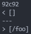

[Back](https://playereugene.github.io/cse15l-lab-reports/)
# Lab 5 Report
This page is for the two tests that did not result in the same answers for my markdown-parse vs the given markdown-parse by Joe Politz. I took two tests that gave different outputs and compared which one was the correct implementation.

## Pre-lab information
My GitHub repository [here](https://github.com/PlayerEugene/markdown-parse)\
Politz's GitHub repository [here](https://github.com/ucsd-cse15l-w22/markdown-parse)

## Finding the Tests with Different Results
To start this lab, I needed to find the results that gave different outputs for my code and the provided code. To do this, I used the method that was explored in *lab 9*. This method was to use `bash script.sh`. The script.sh file had instructions to run through every file and fun the **markdownparse** methods on it.\
With this, we can use `bash script.sh > results.txt` which stores the output of `bash script.sh` to a file called `results.txt`. We can do this in both repositories to get two copies of `results.txt`, one for my code, and one for the given.\
Now that I had both of the `result.txt` files, I could run
```
diff markdown-parse/results.txt markdown-parse-lab10/results.txt
```
The `diff` command allows me to view all the lines that are different from each other in the file. Here are some of the errors that popped up when using `diff`.\


## Error 1
For the first test, I will be going over the following discrepancy on line 92.\


As we can see here the output for my code was `[]` while the output for the given code was `[/foo]`. After looking into the results.txt file for line 92 I found that it was in `14.md`. We know this is right because on line 92 it gives the output `[/foo]` which is what we were looking for.\
\
Now to check for what the result should be, we can preview `14.md` for the output that it would result in which looks like the following.\
\
Clealy here, the output that my code gave is the correct output in this case because VS code's preview does not recognize any of the text as a link and thus should show no links which mine does.\
On the other hand, the provided code resulted in a fake link, `/foo`, which was not an actual link. The reason that the given code did not work for this test is because the **code does not check for anything in front of the link to signify if there is something like a slash or an exclamation point behind the link** which could mean that it is an image or something else.\
\
So here we could put an `if` statement which checks for the exclamation point or the slash which would deny the link being added to the array.

## Error 2
For the second test, I will be going over the following discrepancy on line 212.\


As we can see here the output for my code was `[]` while the output for the given code was `[url]`. After looking into the results.txt file for line 212 I found that it was in `194.md`. We know this is right because on line 194 it gives the output `[url]` which is what we were looking for.\
\
Now to check for what the result should be, we can preview `194.md` for the output that it would result in which looks like the following.\
\
Clealy here, the output that the provided code gave is the correct output in this case because VS code's preview says that `Foo*bar]` is a link and thus should `url` as a link which the given code does.\
On the other hand, my code resulted in no link when it should have shown a link. The reason that my code did not work for this test is because the **code checks for the end bracket and the start parenthesis together when they can be separate**.\
\
So here we could check for the ending bracket and the starting parenthesis separately in order to fix this code.